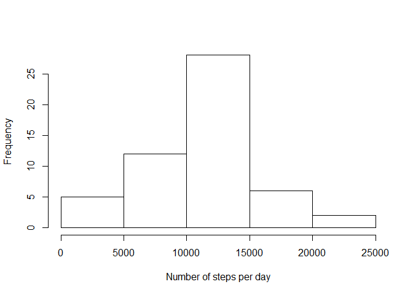
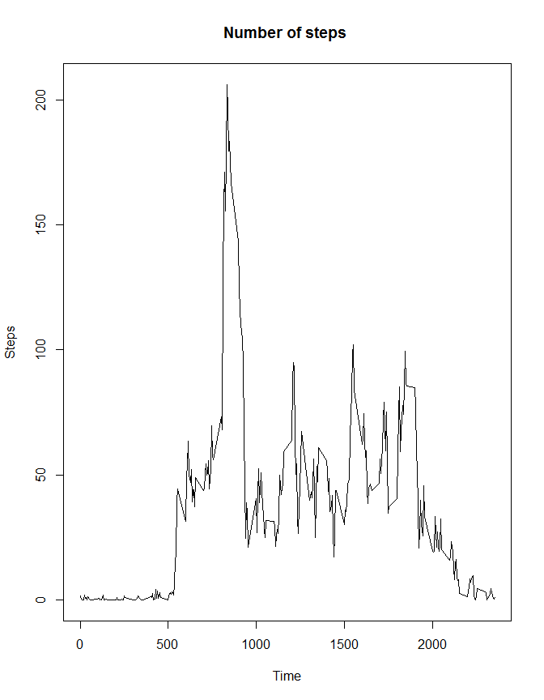
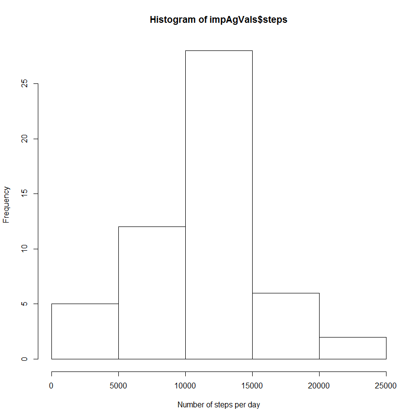
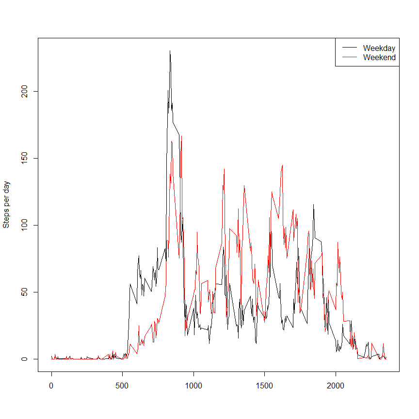

# Reproducible Research: Peer Assessment 1

It is now possible to collect a large amount of data about personal movement using activity monitoring devices such as a Fitbit, Nike Fuelband, or Jawbone Up. These type of devices are part of the "quantified self" movement -- a group of enthusiasts who take measurements about themselves regularly to improve their health, to find patterns in their behavior, or because they are tech geeks. But these data remain under-utilized both because the raw data are hard to obtain and there is a lack of statistical methods and software for processing and interpreting the data.

This assignment makes use of data from a personal activity monitoring device. This device collects data at 5 minute intervals through out the day. The data consists of two months of data from an anonymous individual collected during the months of October and November, 2012 and include the number of steps taken in 5 minute intervals each day.

## Loading and preprocessing the data
Loading the data is straight forward using the command read.csv. To reproduce the report is will be necessary to adapt the path to the file activity.csv.

```r
#Read the data
orig_steps <- read.csv("D:/R/Coursera/reproducible/assignment1/activity.csv",header=TRUE)
```
Further preprocessing, e.g. reformatting the data will be necessary. But as these activities depend on the 
questions to be answered and on the charts to be produced preprocessing is included in the subsections.


## What is mean total number of steps taken per day?
The data contains the data in time intervals of 5 minutes for different days. To get an impression
of the number of steps per day aggregation is necessary. The sum function is used to aggregate over all 5-minute
intervals.

```r
#Regard date as a factor to simplify aggregation
steps <- transform(orig_steps, date = factor(date))
agSteps <- aggregate(steps ~ date, steps, sum)
hist(agSteps$steps, xlab = "Number of steps per day", main="")
```

 

```r
mean_steps   <- mean(agSteps$steps)
median_steps <- median(agSteps$steps)
```
The mean 1.0766189\times 10^{4} and the median 10765 are very close together.   

Please note that there are two days with a very low number of steps. But as this low number is not due to NAs
these two days are not deleted.

## What is the average daily activity pattern?
This time it is necessary to aggregate over the different dates. The mean function is used to find out the
daily movement pattern


```r
agSteps <- aggregate(x=orig_steps$steps, by=list(orig_steps$interval), FUN=mean,na.rm = TRUE)
plot(agSteps$Group.1, agSteps$x, type='l',main = "Number of steps ", xlab = "Time", ylab= "Steps")
```

 

There are four diffent peaks. The first one might be interpreted as going to work, the second one as a short
walk during the break. The third peak might be interpreted as going-home. The last peak is situated at 
about 6 or 7 pm. Maybe the person is doing some sports. 

## Imputing missing values
Now lets test wether there are some missing values.

```r
mis_val <- length(orig_steps$steps) - sum(complete.cases(orig_steps))
```

Alltogether there are 2304 missing values. To get rid of themthey will be replaced with the mean of the steps at the time of the 
missing value

```r
imputedVals <- orig_steps
for(i in 1:length(imputedVals$steps))
{
    if (is.na(orig_steps[i,1])) imputedVals[i,1] <- agSteps[agSteps$Group.1 == imputedVals[i,3],2]
}  

impVals <- transform(imputedVals, date = factor(date))
impAgVals <- aggregate(steps ~ date, steps, sum)
hist(impAgVals$steps, xlab = "Number of steps per day")
```

 

Now let us test whether the missing values have an effect on the median and on the mean.


```r
mean_agsteps <- mean(impAgVals$steps)
median_agsteps <- median(impAgVals$steps)
```
The mean after the imputation is 1.0766189\times 10^{4}, the median is 10765.

## Are there differences in activity patterns between weekdays and weekends?
To find out the difference between weekdays and weekends the date has to be transformed and afterwards saturday and sunday 
are regarded as weekend, the other days as wweekdays.


```r
#Change the type of date in order to calculate the weekday
impAgVals <- transform(impAgVals, date = as.character(date))
impAgVals <- transform(impAgVals, date = strptime(date, format = "%Y-%m-%d"))
    
#Calculate the weekdays
#Please note that the result of weekdays depends on the languge. "Samstag" is the german
#word for saturday and Sonntag means sunday
imputedVals <- transform(imputedVals, date = as.character(date))
imputedVals <- transform(imputedVals, date = strptime(date, format = "%Y-%m-%d"))
imputedVals$w_day <- weekdays(imputedVals$date) 
imputedVals <- transform(imputedVals , w_day = ifelse(imputedVals$w_day == "Samstag" |
                                                      imputedVals$w_day == "Sonntag",
                                                                  "weekend", "weekday"))
imputedVals <- transform(imputedVals, w_day = factor(w_day))
imputedVals <- imputedVals[,c(1,3,4)]
agImpVals <- aggregate(steps ~ w_day + interval, imputedVals,mean)
work <-   agImpVals[as.character(agImpVals$w_day) == "weekday", ]
family <- agImpVals[as.character(agImpVals$w_day) == "weekend",]
plot(work$interval,   work$steps, type="n",xlab = "",ylab = "Steps per day", col = "black")
points(work$interval, work$steps, type="l",xlab = "",ylab = "Steps per day", col = "black")
points(family$interval, family$steps, type="l",xlab = "",ylab = "Steps per day", col = "red")
legend("topright", lty=1, col=c("Black","red"), legend= c("Weekday", "Weekend"))
```

 

There are different pattern between weekday and weekend. 
